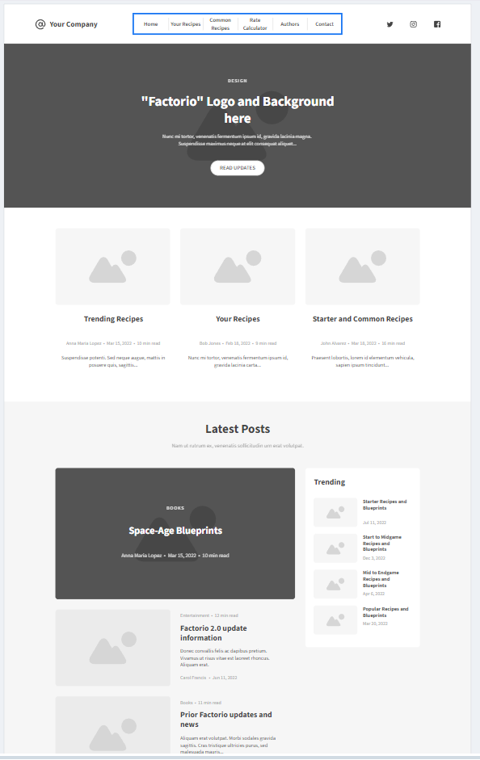
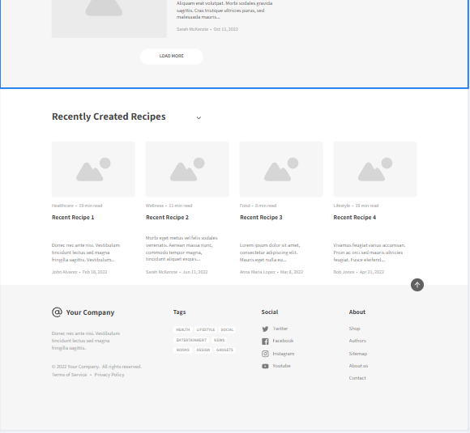
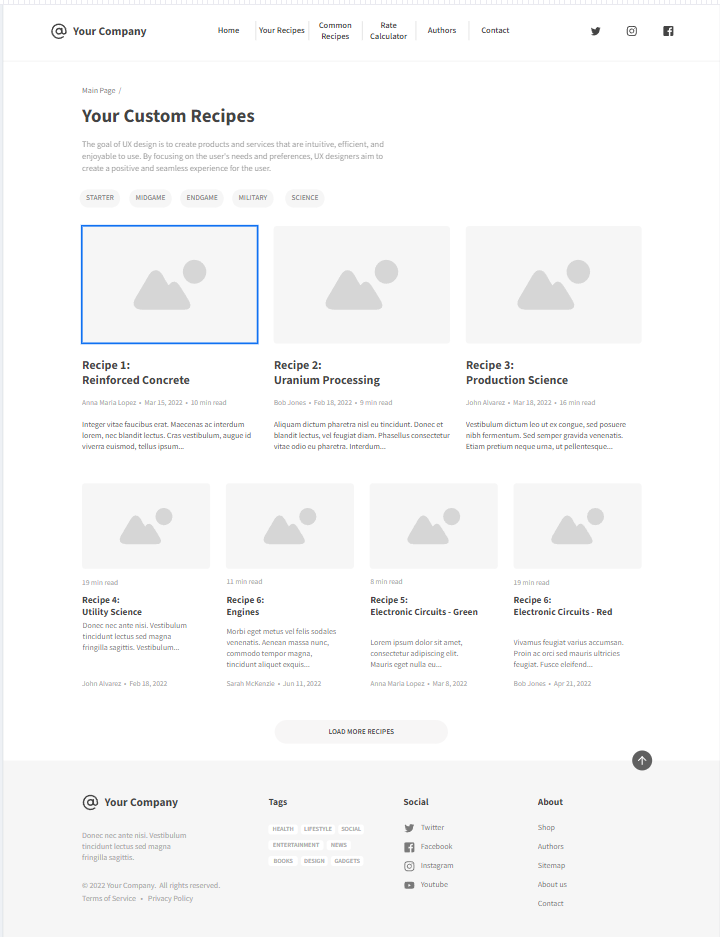
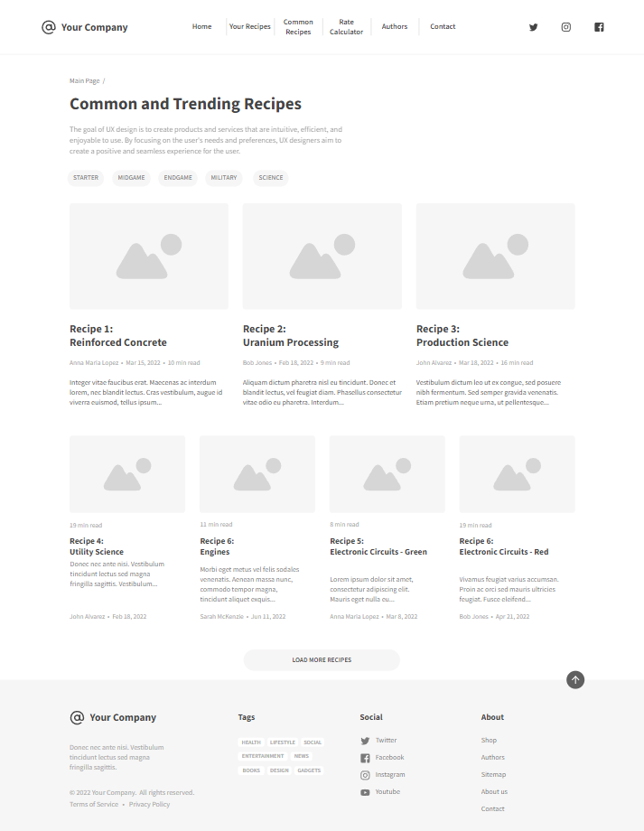
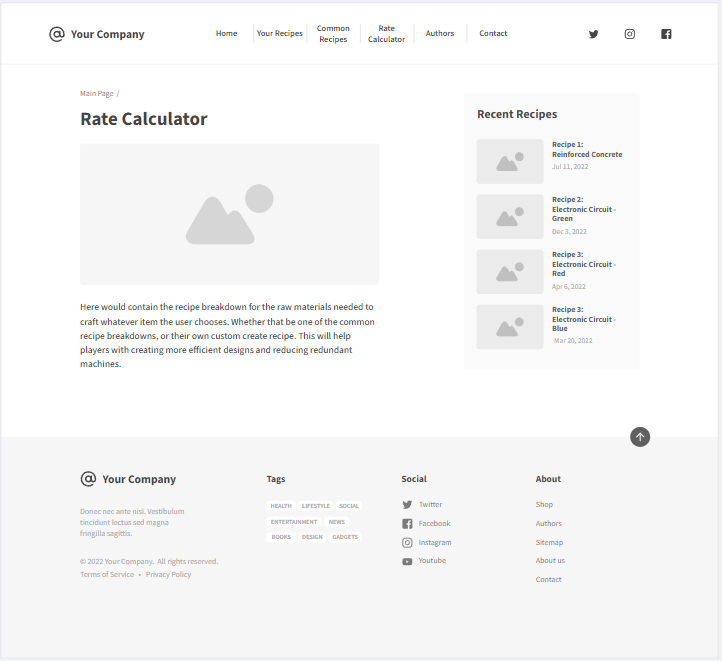
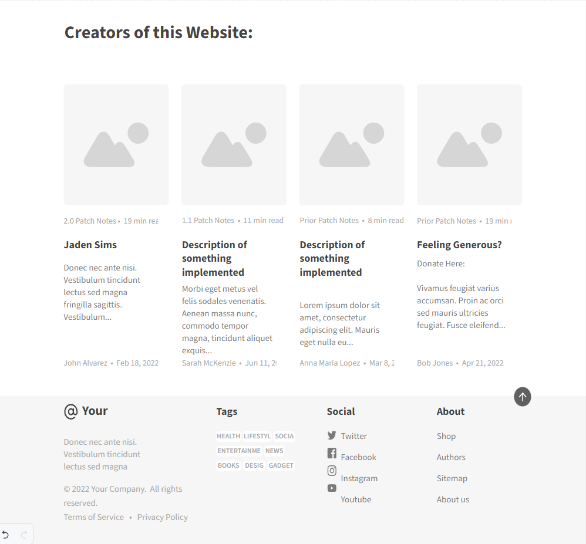
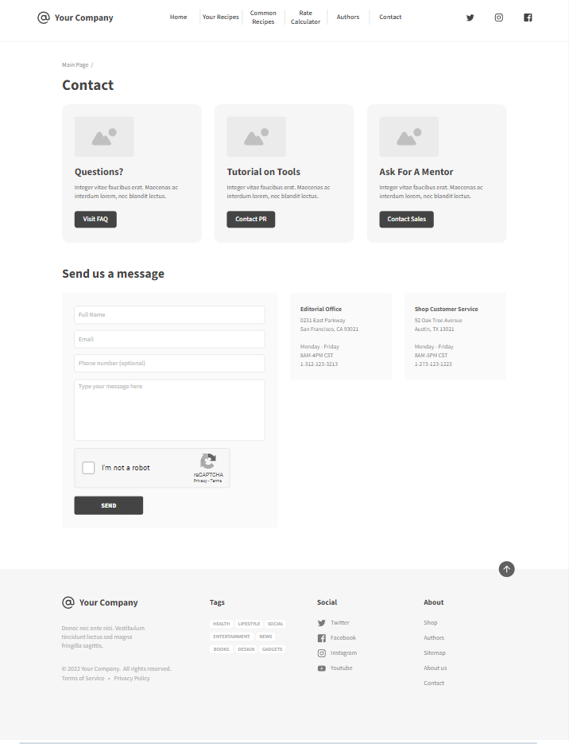

# Web Dev Starter Code

## Project Spec

### General Theme
The Factorio Recipe Builder is a specialized web application designed for gaming enthusiasts who want to maximize efficiency in Factorio. The theme of this project revolves around creating a recipe repository and calculation tool specifically for Factorio players. By blending the elements of a traditional database with dynamic calculation tools, this application will act as both a utility for optimizing their in-game factory designs. The website will also incorporate a intuitive, user-friendly interface where players can manage their crafting recipes, production rates, and required resource allocation.

### What is it going to do?
For my final project, I plan to develop a custom recipe database for the popular game Factorio. This web application will allow users to create, store, and manage their own recipes, helping them optimize production chains within the game. Factorio is a game centered around resource management and automation, and this tool will provide players with a valuable resource for enhancing their gameplay experience and giving them more options for efficiency. By allowing users to create custom recipes and perform real-time calculations on production rates, this application will serve as a practical tool for both casual players and dedicated enthusiasts who want to push the limits of production.

### Target Audience
The target audience for this web application is the Factorio player base, which includes a wide range of users from casual gamers to hardcore strategy enthusiasts. While the game appeals to anyone interested in resource management, engineering, and automation, this tool is particularly aimed at players who are deeply invested in optimizing their factory layouts and maximizing efficiency. Whether they are newcomers seeking guidance on basic recipes or veterans experimenting with custom production chains, this platform offers something for everyone.

### Data Management
The application will manage several types of dynamic data generated by user interaction. Users will be able to input and store their own custom recipes, which include detailed information about raw materials, output quantities, and production times. This data will be saved to a secure database, allowing users to access their recipes at any time. Additionally, the Rate Calculator will dynamically process user input to provide real-time calculations, ensuring players can quickly adapt their strategies based on changing gameplay conditions.
Other forms of dynamic data include user feedback or inquiries submitted through the Contact page, which will be stored and managed for follow-up and troubleshooting.

### Stretch Goals
Once the main features are up and running, I want to add some really cool extras to make the website even better. First off, I wanted to add some user account management. This means players can create their own accounts to save their recipes, production rates, and blueprints. If someone doesn’t want to sign up, that’s totally fine—they can use guest accounts instead. These will let them mess around with the tools and explore the site without needing to commit to a full account.
I’m also planning to include public blueprints and recipe menus. Think of this as a community hub where users can share their favorite builds or check out what others have created. On top of that, I’d love to bring in Factorio’s API, so players can pull in-game data directly into the web app. No more typing everything out manually—this integration will make things super seamless and save a ton of time.
Another fun feature would be visualization tools. Basically, this would let players create a visual model of their blueprints right on the website. It’s like having a mini-planner for your factory layouts, which could help a lot when trying to figure out the best setup.
Lastly, I want to add a way to export recipes and blueprints as in-game strings. This would let users take their custom designs and instantly import them back into Factorio. These extras aren’t required, but they’d make the site way more interactive and useful for anyone who loves optimizing their gameplay.

## Project Wireframe

Images of the wireframe implementation:

